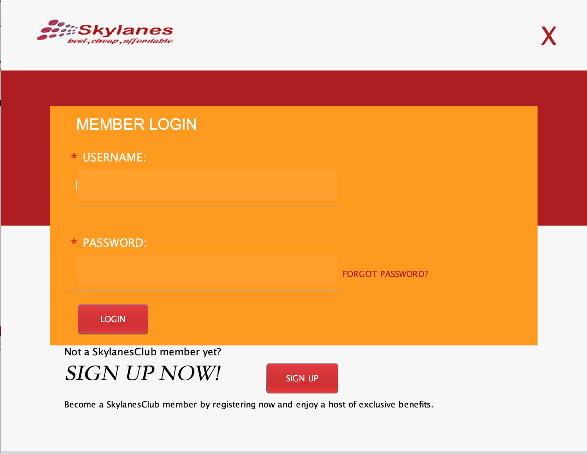
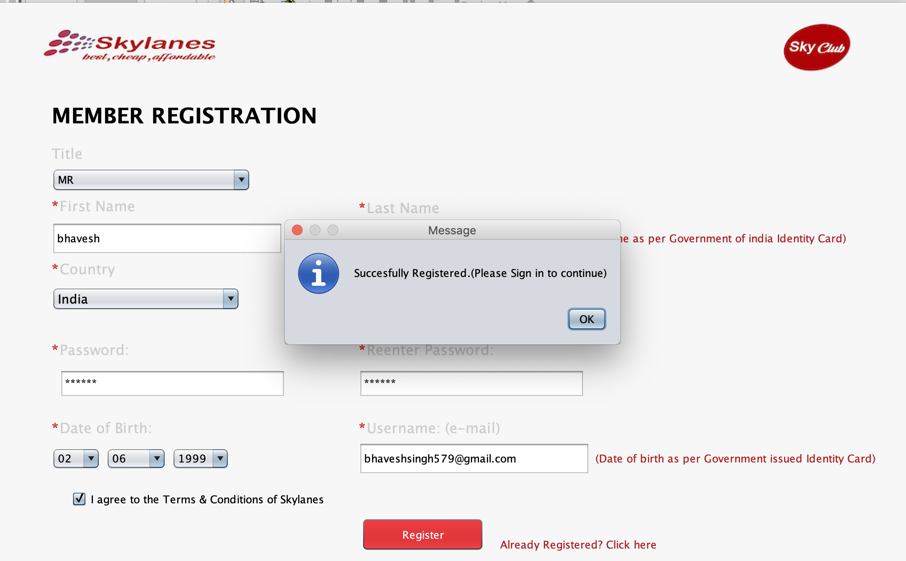
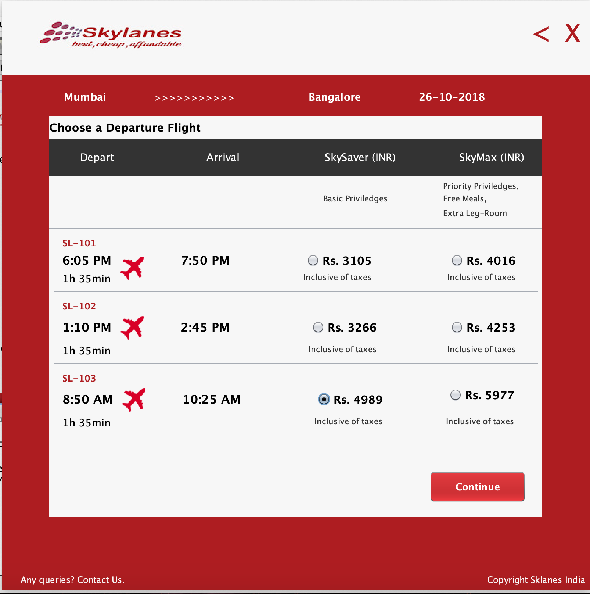
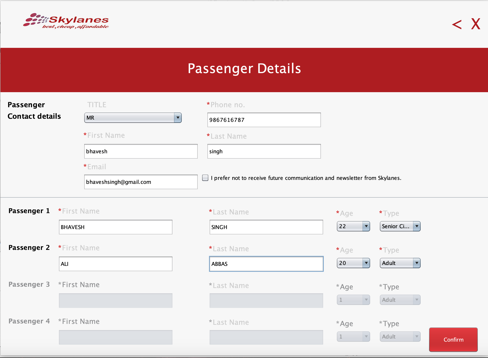
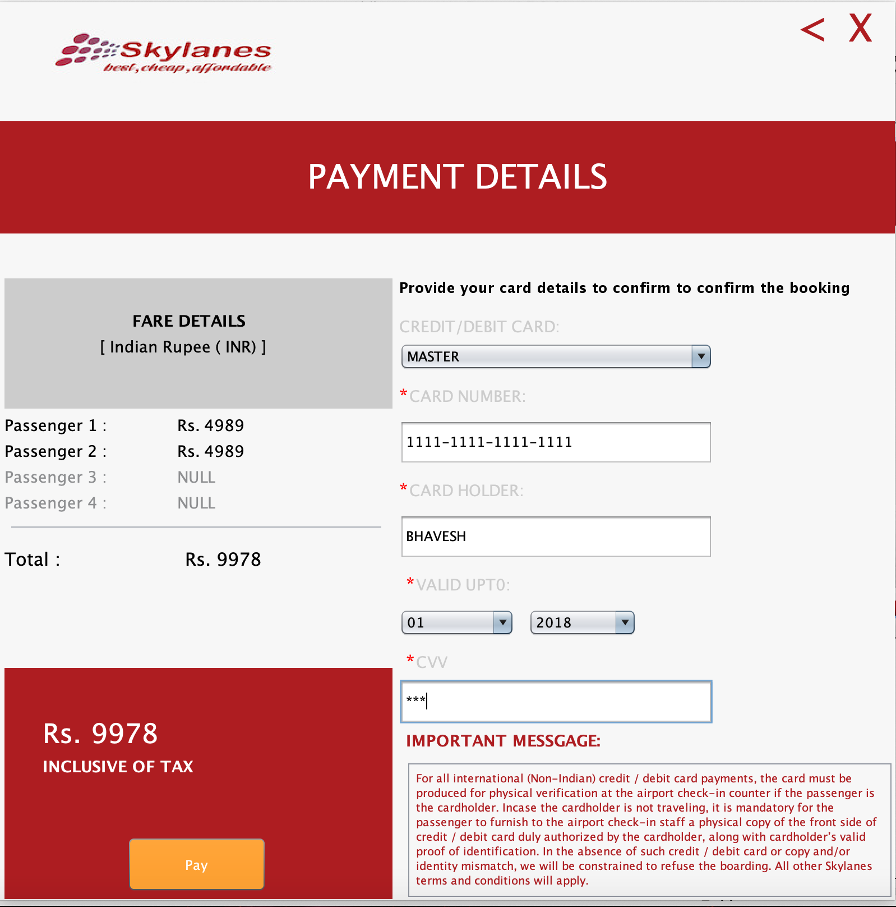
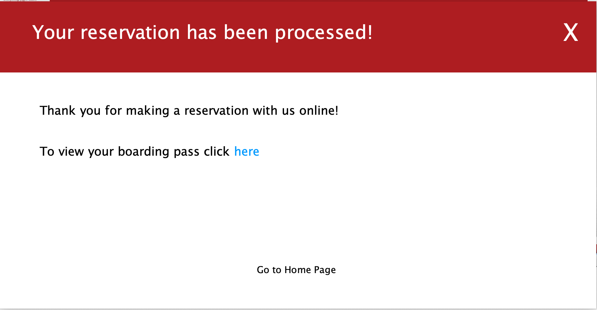
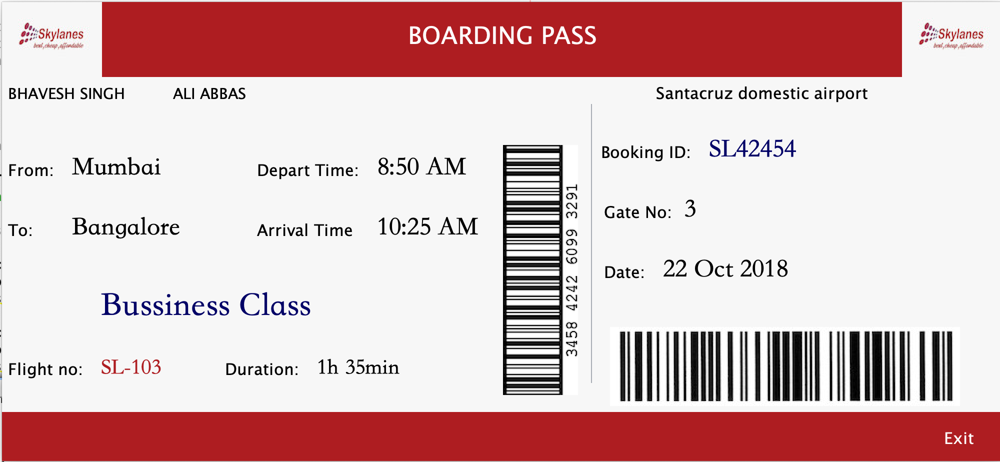

# Airline Reservation

### About

Airline Reservation is an application where users can book flight tickets as the name suggests. It offers a variety of famous Indian airlines which had been added to the database. One can select the date for booking, along with the origin and destination and can filter the available options.

## Flow

- User has to login to the system
- Select a date and then enter the origin and destination
- A list of flights will be filtered and then the user can select their pick
- On the payment portal one has to enter their card details for payment
- A boarding pass is generated at the end of the session after a successful payment

### Technology Stack

- Web Frontend developed using Netbeans

- Backend developed using Java

- Database - Sqlite

## Screenshots

### Login/Registration

### Dashbaord

### Boarding Pass

## MIT LICENSE

> Copyright (c) 2018 Bhavesh Singh
>
> Permission is hereby granted, free of charge, to any person obtaining a copy
> of this software and associated documentation files (the "Software"), to deal
> in the Software without restriction, including without limitation the rights
> to use, copy, modify, merge, publish, distribute, sublicense, and/or sell
> copies of the Software, and to permit persons to whom the Software is
> furnished to do so, subject to the following conditions:
>
> The above copyright notice and this permission notice shall be included in all
> copies or substantial portions of the Software.
>
> THE SOFTWARE IS PROVIDED "AS IS", WITHOUT WARRANTY OF ANY KIND, EXPRESS OR
> IMPLIED, INCLUDING BUT NOT LIMITED TO THE WARRANTIES OF MERCHANTABILITY,
> FITNESS FOR A PARTICULAR PURPOSE AND NONINFRINGEMENT. IN NO EVENT SHALL THE
> AUTHORS OR COPYRIGHT HOLDERS BE LIABLE FOR ANY CLAIM, DAMAGES OR OTHER
> LIABILITY, WHETHER IN AN ACTION OF CONTRACT, TORT OR OTHERWISE, ARISING FROM,
> OUT OF OR IN CONNECTION WITH THE SOFTWARE OR THE USE OR OTHER DEALINGS IN THE
> SOFTWARE.
